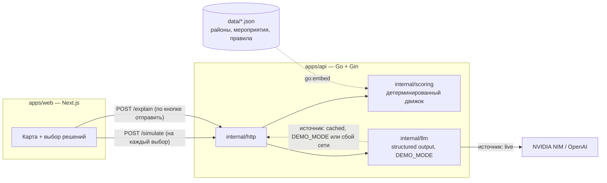

<p align="center">
  
</p>

<p align="center">
  
  
  
  
  
  
  
</p>

<p align="center">
  Распредели виртуальный бюджет 100 у.е. между районами города за 5 решений — получи честный, пересчитываемый <b>Astana Quality of Life Score</b> и AI-разбор компромиссов.
</p>

<p align="center">
  <a href="#демо-за-60-секунд">Демо</a> ·
  <a href="#быстрый-старт">Быстрый старт</a> ·
  <a href="#архитектура">Архитектура</a> ·
  <a href="#api">API</a> ·
  <a href="#команда">Команда</a>
</p>

> [!NOTE]
> Текущее состояние: симулятор, Go API, сравнение сценариев и индикатор оптимума работают вместе. Демо запускается локально без API-ключа с `DEMO_MODE=true`; подробности — в [`.ai/STATUS.md`](.ai/STATUS.md).

## Что это

| | |
|---|---|
| **Живая карта города** | Каждое решение сразу перекрашивает районы на карте — видно, что улучшилось и где остались критические зоны |
| **Честный Score** | Один детерминированный движок на Go считает всё по формуле из ТЗ; никаких чисел «от руки» |
| **AI-разбор** | LLM получает уже посчитанный результат и объясняет сильные стороны, риски и компромиссы — сам ничего не считает |
| **Контроль бюджета** | Превысить 100 у.е. или нарушить правила (лимит на направление, несовместимые меры) невозможно — сервер отклонит набор с точным кодом ошибки |
| **Сравнение сценариев** | 2–3 набора решений бок о бок, с AI-комментарием, что и почему отличается |
| **Потолок возможного** | «Ваш результат — это X% от лучшего из всех допустимых наборов» |

## Демо за 60 секунд

Сценарий — рабочий пример из ТЗ.

1. Открыть симулятор. Базовый Score города — **52.56**. Худший район — Нура: два показателя ниже критического порога 40 (школы/детсады S1=38, поликлиники S2=35).
2. Выбрать 5 решений: Школа + детсад → Нура, Поликлиника → Нура, Освещение и камеры → Нура, Единая цифровая платформа обращений (городская), Перевод частного сектора на чистое топливо → Сарыарка.
3. Карта Нуры перекрашивается по ходу выбора; потрачено 95 из 100 у.е.
4. Отправить набор → Score **56.54 (+3.99)**, критических показателей больше нет, сработала синергия «Освещение + Платформа обращений» (+2 к безопасности Нуры сверх суммы отдельных эффектов).
5. AI объясняет: главный провал города закрыт, но транспорт и экология Нуры не тронуты, а бюджет почти исчерпан.

| Район | Score до | Score после |
|---|---:|---:|
| Есиль | 62.99 | 63.43 |
| Алматы | 57.06 | 57.50 |
| Сарыарка | 54.65 | 56.30 |
| Байконур | 56.63 | 57.07 |
| Нура | 49.18 | 52.96 |
| **Город (D_avg)** | **56.86** | **58.08** |
| **Итоговый Score** | **52.56** | **56.54** |

## Как считается Score

$$
\text{Score} = 0.7 \cdot D_{avg} + 0.3 \cdot \min_d(D_d) - 1.0 \cdot N_{crit}
$$

где $D_d = \sum_k w_k \cdot I'_{dk}$ — взвешенная сумма 10 показателей района после применения эффектов мероприятий (с учётом лага и синергий, с обрезкой в диапазон 0–100), $D_{avg}$ — средневзвешенный по населению балл города, а $N_{crit}$ — число пар «район × показатель» со значением строго меньше 40.

<details>
<summary>Веса показателей и правила отбора</summary>

| Показатель | T1 | T2 | E1 | E2 | S1 | S2 | B1 | B2 | C1 | C2 |
|---|---|---|---|---|---|---|---|---|---|---|
| Вес | 0.10 | 0.10 | 0.09 | 0.11 | 0.11 | 0.11 | 0.09 | 0.09 | 0.10 | 0.10 |

- Бюджет: 100 у.е., решений ровно 5, повторы запрещены.
- Не более 2 мер из одного направления.
- Несовместимости: M1×M3 (в любом районе), M4×M7 и M5×M13 (только если один район).
- Синергии дают фиксированный бонус, если выбраны обе меры пары (например, M10+M12 → +2 к B1 в районе M10).

Полная спецификация и разбор шаг за шагом — [`contracts/scoring.md`](contracts/scoring.md).
</details>

## Архитектура



LLM никогда не вызывается с фронтенда и никогда не пересчитывает числа — только объясняет то, что уже посчитал `internal/scoring`.

## Быстрый старт

Для `make dev` нужны Go 1.26, Node.js 22 и npm; для Compose нужен Docker. В `.env` установите `DEMO_MODE=true`, чтобы объяснения и сравнения работали без ключа и сети LLM.

```bash
git clone https://github.com/BAITC-Hacks/hack-2e79658e-nosleep-dev
cd hack-2e79658e-nosleep-dev
cp .env.example .env
# установить DEMO_MODE=true в .env
make dev            # установит npm-зависимости при первом запуске; API :8000, web :3000
# либо: docker compose up --build
```

Открыть [http://localhost:3000](http://localhost:3000).

**Проверка:**
```bash
curl http://localhost:8000/health        # {"status":"ok"}
python3 scripts/verify.py                # независимая перепроверка формулы Score
cd apps/api && go test ./...              # тесты API, движка и LLM-клиента
```

## Переменные окружения

| Переменная | Обязательна? | Где взять |
|---|---|---|
| `API_PORT` | нет, по умолчанию 8000 | — |
| `WEB_ORIGIN` | нет | — |
| `DATA_DIR` | нет | — |
| `LLM_BASE_URL` | нет, по умолчанию NVIDIA NIM | [build.nvidia.com](https://build.nvidia.com) |
| `LLM_API_KEY` | для живого AI-разбора | бесплатный ключ на build.nvidia.com, либо ключ OpenAI |
| `LLM_MODEL` | для живого AI-разбора | зависит от провайдера |
| `LLM_TIMEOUT_SECONDS` | нет, по умолчанию 25 | — |
| `DEMO_MODE` | нет, по умолчанию false | `true` — работает вообще без ключей и модели |
| `NEXT_PUBLIC_API_URL` | нет | — |
| `NEXT_PUBLIC_USE_MOCKS` | нет | `true` — фронт работает по `contracts/examples/*.json` без бэкенда |

Если не заданы одновременно `LLM_API_KEY`, `LLM_MODEL` и `DEMO_MODE=false`, `/explain` и `/compare` автоматически отдают кэшированный ответ — это не ошибка, а расчётный fallback.

## AI и DEMO_MODE

- LLM вызывается только из бэкенда, только на `POST /explain` и `POST /compare` — никогда на каждый клик и никогда с фронтенда.
- Ответ — строго структурированный JSON (JSON Schema), 2 попытки на валидный ответ, затем откат на кэш.
- Таймаут на вызов — 25 секунд по умолчанию.
- Каждый ответ помечен `"source": "live"` или `"source": "cached"` — в интерфейсе это видно как бейдж; кэш никогда не выдаётся за живой ответ.
- `DEMO_MODE=true` отдаёт кэшированный, детерминированный ответ без единого сетевого вызова — судьи могут проверить весь сценарий без ключей.

## API

Базовый путь `/api/v1`. Полная спецификация с примерами запросов/ответов — [`contracts/api.md`](contracts/api.md), примеры JSON — [`contracts/examples/`](contracts/examples/).

| Метод | Путь | Назначение |
|---|---|---|
| `GET` | `/health` | проверка живости |
| `GET` | `/catalog` | датасет районов, мероприятий, бюджет |
| `POST` | `/simulate` | live-предпросчёт по 0–5 решениям, без AI |
| `POST` | `/explain` | финальный расчёт + AI-разбор по 5 решениям |
| `GET` | `/optimum` | лучший возможный Score (перебор допустимых наборов) |
| `POST` | `/compare` | 2–3 сценария бок о бок + AI-сравнение |
| `POST` | `/events/draw` | случайное городское событие, требующее пересчёта бюджета |

## Тесты

- [`data/fixtures/golden.json`](data/fixtures/golden.json) — 3 валидных и 9 невалидных (по одному на каждый код ошибки) сценария с эталонными значениями Score, используются как table-driven тест `internal/scoring`.
- [`scripts/verify.py`](scripts/verify.py) — независимая реализация формулы на Python для перепроверки движка Go.
- Бэкенд: happy path `/simulate`, ошибки валидации по каждому коду, деградация AI-вызова на кэш.

<details>
<summary>Структура репозитория</summary>

```
apps/
  web/                 Next.js — карта, выбор решений, результат
  api/
    cmd/server/        точка входа, wiring
    internal/http/     Gin-роуты, DTO, CORS, ошибки
    internal/scoring/  детерминированный движок Score
    internal/llm/       клиент LLM, DEMO_MODE, структурированный вывод
    internal/optimizer/ перебор допустимых наборов для /optimum
    internal/events/    городские события для /events/draw
contracts/             API-контракт, формула, примеры JSON
data/                  районы, мероприятия, правила, golden-фикстуры
scripts/verify.py      независимая перепроверка формулы
.ai/                   план, статус, решения, критерии оценки, workflow команды
```
</details>

## Roadmap

- [x] Контракт API и формула Score, перепроверенная независимым скриптом
- [x] Полный датасет: 5 районов, 14 мероприятий, синергии, несовместимости
- [x] Движок `internal/scoring` с golden-тестами
- [x] AI-объяснение `internal/llm` со структурированным выводом и DEMO_MODE
- [x] HTTP-обвязка `internal/http` и `cmd/server`
- [x] Веб-интерфейс: выбор решений, схематичная SVG-карта, результат
- [x] `/optimum` и `/compare`
- [x] Городские события `/events/draw` в API (без экранного сценария)
- [ ] Географическая карта районов (после демо; сейчас работает SVG-карта)

**После хакатона:** командный лидерборд с сохранением результатов нескольких команд; оценить [Jev](https://typesafe.ai) (модель для быстрых структурированных решений) как способ ранжировать AI-рекомендации отдельно от текстового объяснения.

## Команда

NoSleep.dev — без выделенного лида, три равных роли. Полные договорённости о процессе — [`.ai/WORKFLOW.md`](.ai/WORKFLOW.md).

| Роль | Отвечает за |
|---|---|
| Frontend | `apps/web` — карта, интерфейс выбора, результат |
| Backend | `apps/api/cmd`, `internal/http`, `Makefile`, Docker |
| AI + Data | `internal/scoring`, `internal/llm`, `internal/optimizer`, `internal/events`, `data/`, README |

<p align="center">
  <sub>BAITC Hackathon 2026 · «Аким на 5 часов»</sub>
</p>
