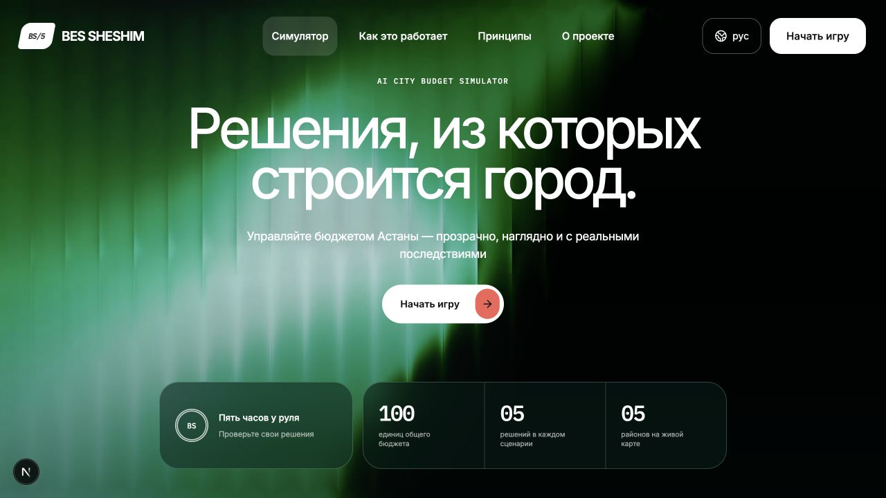
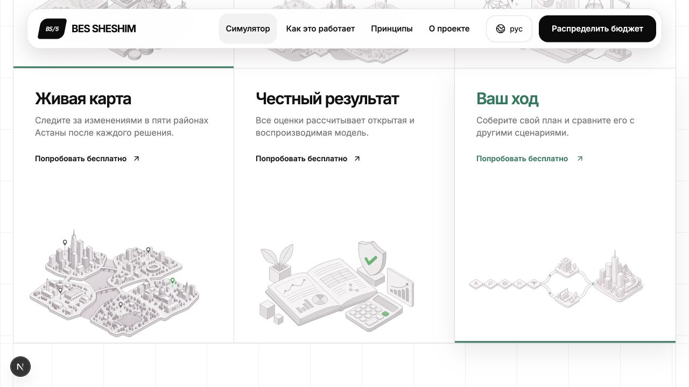

  

  
  
  

  <b>Пять решений. Один город. Последствия видны сразу.</b> 
  Примерьте роль акима Астаны: распределите 100 условных единиц между городскими инициативами и увидьте, как ваш выбор влияет на пять районов.

  <a href="#демо-за-60-секунд">Демо за 60 секунд</a> ·
  <a href="#docker-один-контейнер">Docker</a> ·
  <a href="#как-запустить">Локальная разработка</a> ·
  <a href="#как-считается-результат">Формула</a> ·
  <a href="#что-реализовано">Статус</a>

## BesSheshim за 20 секунд

| Вы делаете | Город показывает | Вы понимаете |
|---|---|---|
| Выбираете **ровно 5** из 14 инициатив в пределах **100 единиц** бюджета | Карту районов, показатели качества жизни и итоговый Score | Какие районы выиграли, какие проблемы остались и за что пришлось заплатить |

Задача симулятора — сделать компромиссы городского бюджета понятными. Сильный сценарий поднимает средний результат, но также помогает самому уязвимому району и сокращает число критических показателей.

## Главная страница

  
  Первый экран: задача и правила понятны до начала игры.

  
  Ниже на главной: как продукт помогает увидеть эффект и объяснить результат.

## Демо за 60 секунд

1. Откройте [http://localhost:3000](http://localhost:3000) и нажмите **«Начать игру»**. На старте у города **2 критических показателя** в Нуре; базовый Score по проверенной модели — **52,56**.
2. Добавьте пять мер в указанном порядке: **M7** «Школа + детсад» → Нура, **M8** «Поликлиника» → Нура, **M10** «Освещение и камеры» → Нура, **M12** «Платформа обращений» → весь город, **M5** «Чистое топливо» → Сарыарка.
3. В панели **«Ваш план»** проверьте бюджет: **95 / 100**. Нажмите **«Посмотреть результат»**.
4. Проверенный сценарий даёт **56,54 (+3,99)**. Оба критических показателя Нуры выходят из красной зоны; сочетание M10 + M12 дополнительно улучшает безопасность Нуры. Разбор объясняет и оставшиеся слабые места: транспорт и экологию Нуры.

Это [эталонный сценарий](contracts/examples/simulate-valid.json) из контракта. Числа независимо воспроизводит [scripts/verify.py](scripts/verify.py) и проверяют [golden-фикстуры](data/fixtures/golden.json).

## Как запустить

Для запуска без Docker нужны **Go 1.26+** и **Node.js 20.9+**. Ключ LLM для демонстрации не нужен.

~~~bash
git clone https://github.com/BAITC-Hacks/hack-2e79658e-nosleep-dev.git
cd hack-2e79658e-nosleep-dev
cp .env.example .env
npm --prefix apps/web ci
make dev
~~~

Затем откройте [http://localhost:3000](http://localhost:3000). API доступен на `http://localhost:8000/api/v1`; проверка работоспособности — [`/health`](http://localhost:8000/api/v1/health).

> [!IMPORTANT]
> `make dev` использует `NEXT_PUBLIC_USE_MOCKS=false` из `.env.example` и обращается к Go API. Если запустить только `npm run dev` без `.env`, фронтенд по умолчанию использует локальные демоданные и показывает бейдж `DEMO`.

## Docker: один контейнер

Docker-образ собирает Go API и production-сборку Next.js. Внутри контейнера работают оба процесса; наружу открыт только порт веб-приложения `3000`. Запросы браузера к `/api/v1/*` Next.js перенаправляет на API внутри контейнера. Поэтому один и тот же образ работает на `localhost`, IP-адресе сервера или за обратным прокси без пересборки с новым адресом API.

### Быстрый запуск

Установите Docker с плагином Compose и запустите из корня репозитория:

~~~bash
docker compose up -d --build
docker compose ps
curl -f http://localhost:3000/api/v1/health
~~~

Откройте [http://localhost:3000](http://localhost:3000) и перейдите в симулятор. Ответ проверки API — `{"status":"ok"}`. Compose поднимает **один** сервис `app`; файл `.env` и ключ LLM для этого демо не требуются. При первом запуске Docker загрузит базовые образы, установит Go и npm-зависимости и соберёт оба приложения.

### Без Compose

~~~bash
docker build -t bessheshim:local .
docker run --name bessheshim -d --restart unless-stopped -p 3000:3000 bessheshim:local
docker ps --filter name=bessheshim
curl -f http://localhost:3000/api/v1/health
~~~

Для остановки и удаления контейнера: `docker rm -f bessheshim`. Контейнер не использует базу данных или постоянный том; данные приложения и контрактные примеры входят в образ.

### Порт и размещение на сервере

В Compose `APP_PORT` меняет **порт хоста**, а `APP_BIND` — адрес привязки. Например, если HTTPS завершает обратный прокси на том же сервере:

~~~bash
APP_BIND=127.0.0.1 APP_PORT=8080 docker compose up -d --build
curl -f http://127.0.0.1:8080/api/v1/health
~~~

Направьте обратный прокси на `http://127.0.0.1:8080` и передавайте через него все пути, включая `/api/v1/*` и `/_next/*`. Для прямого доступа с другой машины оставьте `APP_BIND=0.0.0.0` (значение по умолчанию), откройте выбранный `APP_PORT` в сетевом экране и перейдите на `http://IP_СЕРВЕРА:APP_PORT`. Для публичного сайта настройте домен и HTTPS на обратном прокси. В варианте `docker run` порт меняется флагом `-p 8080:3000`.

Не меняйте внутренний `API_PORT=8000` или `PORT=3000`: собранный Next.js направляет API-запросы на `127.0.0.1:8000`, а Docker публикует порт `3000`.

### Обновление и диагностика

~~~bash
git pull
docker compose up -d --build
docker compose logs -f app
docker compose ps
docker compose down
~~~

`docker compose up -d --build` пересобирает образ из текущего кода и заменяет контейнер. В `docker compose ps` статус здоровья должен стать `healthy`: встроенная проверка обращается к `/api/v1/health` через Next.js и тем самым проверяет оба процесса. Если порт занят, задайте `APP_PORT=8080`. Если проверка не проходит, посмотрите `docker compose logs app` и убедитесь, что оба процесса запустились. При завершении одного из процессов контейнер останавливает второй, после чего Compose перезапускает сервис.

Образ собирается с `NEXT_PUBLIC_USE_MOCKS=false` и относительным адресом API `/api/v1`; эти значения в браузерном коде фиксируются **во время сборки**. Переменные `LLM_*` из `.env.example` пока не меняют ответы контейнера: текущий HTTP-сервер обслуживает контрактные фикстуры, как описано в разделе «Что реализовано».

## Как считается результат

Результат рассчитывается по [открытой спецификации](contracts/scoring.md), на одинаковых исходных данных для каждого игрока:

$$
\text{Score} = 0.7 \cdot D_{avg} + 0.3 \cdot \min_d(D_d) - N_{crit}
$$

Здесь `D_avg` — средний балл районов с учётом населения, `min D_d` — балл самого уязвимого района, `N_crit` — число показателей ниже 40. Формула учитывает не только общий рост, но и состояние самого слабого района. Эффекты инициатив учитывают задержку, а некоторые сочетания дают синергию.

| Проверенный пример | До | После |
|---|---:|---:|
| Итоговый Score | 52,56 | **56,54** |
| Критические показатели | 2 | **0** |
| Бюджет | 0 / 100 | **95 / 100** |

Данные и правила лежат в [data/](data/), а независимая реализация формулы — в [scripts/verify.py](scripts/verify.py). Реализованный AI-клиент получает готовые результаты для объяснения; он не рассчитывает Score.

## Что реализовано

| Часть | Текущий статус |
|---|---|
| Главная и интерфейс симулятора | Запускаются локально; выбор инициатив, районов, бюджет и результат доступны в UI |
| Детерминированный движок Score | Реализован на Go в [internal/scoring](apps/api/internal/scoring/) и покрыт golden-тестами |
| HTTP API | Маршруты работают; **текущий сервер подключён к контрактным фикстурам**, а не к движку Score. Для произвольного набора решений результат пока может быть заглушкой |
| AI-разбор | Go-клиент со структурированным ответом и fallback реализован отдельно; HTTP-сервер сейчас отдаёт проверенный кэшированный разбор для эталонного сценария |
| Оптимум, сравнение, городские события | [Optimizer](apps/api/internal/optimizer/) и [события](apps/api/internal/events/) реализованы как Go-модули; соответствующие API-маршруты пока отдают фикстуры, а сравнение ещё не выведено в UI |

Это hackathon demo build. Для точной проверки модели используйте тесты и эталонный сценарий выше; интеграция движка и AI-клиента в HTTP-сервер — следующий шаг.

## Архитектура

~~~mermaid
flowchart LR
    Player[Игрок] --> Web[Next.js интерфейс]
    Web --> API[Go + Gin API]
    API --> Fixtures[Контрактные примеры JSON]
    Data[data/*.json] --> Engine[Движок Score на Go]
    Engine --> Tests[Golden-тесты и независимая проверка]
    LLM[Go AI-клиент] -. следующий шаг: подключить .-> API
    Engine -. следующий шаг: подключить .-> API
~~~

Контракт API — в [contracts/api.md](contracts/api.md). Основные маршруты: `GET /catalog`, `POST /simulate`, `POST /explain`, `GET /optimum`, `POST /compare`, `POST /events/draw`.

## Проверка

~~~bash
python3 scripts/verify.py
cd apps/api && go test ./...
~~~

Ожидаемые опорные значения: `BASE Score=52.5577`, `EX Score=56.5431`. Go-тесты проверяют scoring, HTTP, LLM-клиент, optimizer и события. Проверка `npm run lint` сейчас выявляет два существующих нарушения React hooks в `astana-three-map.tsx`.

## Команда

**NoSleep.dev** · BAITC Hackathon 2026 · Астана, Казахстан

BesSheshim — «Аким на 5 часов». Пять решений. Один город.
